# ZIPZA-BE ERD

현재 프로젝트의 JPA 엔티티 기준 ERD입니다. 모든 엔티티는 `BaseEntity`를 상속하므로 공통 PK `id UUID`를 가집니다.

```mermaid
erDiagram
    USER {
        UUID id PK
        VARCHAR email UK
        VARCHAR nickname
        VARCHAR provider
        VARCHAR provider_id
        DATETIME created_at
        DATETIME deleted_at
    }

    PROPERTY {
        UUID id PK
        VARCHAR road_address
        VARCHAR jibun_address
        VARCHAR detail_address
        VARCHAR building_management_number
        VARCHAR postal_code
        VARCHAR administrative_code
        VARCHAR city
        VARCHAR district
        VARCHAR neighborhood
        VARCHAR building_name
        BOOLEAN is_apartment
        DOUBLE longitude
        DOUBLE latitude
        DATETIME created_at
    }

    ANALYSIS_REQUEST {
        UUID id PK
        UUID user_id FK
        UUID property_id FK
        VARCHAR contract_type
        BIGINT deposit_amount
        BIGINT monthly_rent
        INT floor
        DOUBLE exclusive_area
        DATE contract_date
        DATE balance_date
        DATE expiry_date
        VARCHAR status
        DATETIME requested_at
        DATETIME completed_at
    }

    BUILDING_LEDGER {
        UUID id PK
        UUID property_id FK
        VARCHAR main_purpose_code
        VARCHAR main_purpose_name
        DOUBLE total_floor_area
        DOUBLE building_area
        DOUBLE building_coverage_ratio
        DOUBLE floor_area_ratio
        VARCHAR structure_name
        INT floors_above_ground
        INT floors_underground
        INT household_count
        DATE approval_date
        BOOLEAN is_earthquake_resistant
        DOUBLE exclusive_area
        BOOLEAN is_violation_building
        VARCHAR violation_reason
        VARCHAR violation_detail
        DATETIME fetched_at
    }

    TRADE_RECORD {
        UUID id PK
        UUID property_id FK
        VARCHAR building_type
        VARCHAR contract_type
        BIGINT deposit_amount
        BIGINT monthly_rent
        DOUBLE exclusive_area
        INT floor
        DATE contract_date
        VARCHAR contract_classification
        VARCHAR contract_term
        BIGINT previous_deposit
        BIGINT previous_monthly_rent
        DATETIME fetched_at
    }

    REGISTRY_CANDIDATE {
        UUID id PK
        UUID property_id FK
        VARCHAR unique_number
        VARCHAR real_estate_type
        TEXT location
        BOOLEAN is_selected
        DATETIME fetched_at
    }

    REGISTRY_RAW {
        UUID id PK
        UUID registry_candidate_id FK
        UUID request_id FK
        VARCHAR unique_number
        VARCHAR source_hash
        VARCHAR parse_status
        DATETIME fetched_at
        DATETIME expires_at
    }

    REGISTRY_TITLE {
        UUID id PK
        UUID registry_raw_id FK
        VARCHAR real_estate_type
        TEXT location_address
        VARCHAR building_name
        VARCHAR floor_info
        DOUBLE exclusive_area
        DOUBLE common_area
        VARCHAR purpose
        VARCHAR land_right_type
        VARCHAR land_right_ratio
    }

    REGISTRY_OWNERSHIP {
        UUID id PK
        UUID registry_raw_id FK
        INT rank_number
        VARCHAR registration_purpose
        DATE reception_date
        VARCHAR registration_cause
        DATE registration_cause_date
        VARCHAR owner_name
        VARCHAR owner_id_masked
        VARCHAR share_ratio
        BOOLEAN is_current
    }

    REGISTRY_MORTGAGE {
        UUID id PK
        UUID registry_raw_id FK
        INT rank_number
        VARCHAR registration_purpose
        DATE reception_date
        VARCHAR registration_cause
        BIGINT claim_amount
        VARCHAR debtor_name
        VARCHAR creditor_name
        BOOLEAN is_erased
        DATE erase_date
    }

    REGISTRY_RESTRICTION {
        UUID id PK
        UUID registry_raw_id FK
        INT rank_number
        VARCHAR registration_purpose
        DATE reception_date
        VARCHAR registration_cause
        VARCHAR right_holder_name
        TEXT detail
        BOOLEAN is_erased
        DATE erase_date
    }

    RIGHTS_ANALYSIS {
        UUID id PK
        UUID request_id FK
        UUID registry_raw_id FK
        VARCHAR current_owner
        BOOLEAN is_owner_matched
        BOOLEAN is_recently_owner_changed
        INT owner_change_count
        BIGINT total_mortgage_amount
        BIGINT total_jeonse_right_amount
        BIGINT total_lease_right_amount
        BOOLEAN has_seizure
        BOOLEAN has_provisional_seizure
        BOOLEAN has_forced_auction
        BOOLEAN has_trust
        BOOLEAN has_lease_registration
        DATE registry_date
        INT risk_score
        TEXT risk_reason
        DATE latest_owner_change_date
        INT trust_entry_count
        TEXT summary_text
        DATETIME analyzed_at
    }

    BUILDING_ANALYSIS {
        UUID id PK
        UUID request_id FK
        UUID building_ledger_id FK
        BOOLEAN is_purpose_matched
        BOOLEAN is_area_matched
        DOUBLE area_difference
        BOOLEAN is_floor_in_range
        INT building_age
        INT risk_score
        TEXT risk_reason
        BOOLEAN is_address_matched
        BOOLEAN is_usage_matched
        BOOLEAN has_violation_building
        VARCHAR violation_message
        TEXT comparison_warnings
        DATETIME analyzed_at
    }

    CONTRACT_ANALYSIS {
        UUID id PK
        UUID request_id FK
        BOOLEAN has_proxy
        BOOLEAN is_penalty_clause_missing
        BOOLEAN is_return_clause_missing
        BOOLEAN is_repair_clause_missing
        JSON risk_clauses
        JSON recommended_clauses
        VARCHAR source_hash
        VARCHAR parse_status
        INT risk_score
        TEXT risk_reason
        DATETIME analyzed_at
    }

    PRICE_ANALYSIS {
        UUID id PK
        UUID request_id FK
        BIGINT reference_minimum
        BIGINT reference_maximum
        BIGINT reference_median
        INT sample_count
        DATE latest_trade_date
        BOOLEAN is_overpriced
        INT risk_score
        TEXT risk_reason
        DATETIME analyzed_at
    }

    GUARANTEE_ANALYSIS {
        UUID id PK
        UUID request_id FK
        BIGINT deposit_amount
        BIGINT estimated_property_value
        DOUBLE jeonse_rate
        BIGINT region_max_deposit
        VARCHAR guarantee_result
        INT risk_score
        TEXT risk_reason
        DATETIME analyzed_at
    }

    RECOVERY_ANALYSIS {
        UUID id PK
        UUID request_id FK
        BIGINT estimated_property_value
        BIGINT total_encumbrance
        BIGINT deposit_amount
        BIGINT available_for_tenant
        DOUBLE recovery_rate
        VARCHAR recovery_grade
        INT risk_score
        TEXT risk_reason
        DATETIME analyzed_at
    }

    FRAUD_PATTERN_ANALYSIS {
        UUID id PK
        UUID request_id FK
        BOOLEAN has_frequent_mortgage_change
        BOOLEAN has_post_ownership_mortgage
        BOOLEAN has_over_leveraged
        VARCHAR suspicion_level
        INT risk_score
        TEXT risk_reason
        DATETIME analyzed_at
    }

    DIAGNOSIS_REPORT {
        UUID id PK
        UUID request_id FK
        INT price_score
        INT rights_score
        INT building_score
        INT contract_score
        INT confidence_score
        INT total_score
        VARCHAR verdict
        JSON top_risks
        JSON next_actions
        TEXT ai_summary
        VARCHAR share_token
        BOOLEAN is_shared
        DATETIME created_at
    }

    MANUAL_CHECK_ITEM {
        UUID id PK
        UUID request_id FK
        VARCHAR check_type
        VARCHAR title
        VARCHAR badge_text
        VARCHAR severity
        TEXT guide_text
        TEXT procedure_steps
        VARCHAR official_url
        BOOLEAN expert_consult
        BOOLEAN is_completed
        DATETIME checked_at
        DATETIME created_at
    }

    REMINDER {
        UUID id PK
        UUID request_id FK
        UUID user_id FK
        VARCHAR reminder_type
        DATE remind_date
        VARCHAR channel
        BOOLEAN is_sent
        DATETIME sent_at
    }

    USER ||--o{ ANALYSIS_REQUEST : creates
    USER ||--o{ REMINDER : receives

    PROPERTY ||--o{ ANALYSIS_REQUEST : targets
    PROPERTY ||--o{ BUILDING_LEDGER : has
    PROPERTY ||--o{ TRADE_RECORD : has
    PROPERTY ||--o{ REGISTRY_CANDIDATE : has

    ANALYSIS_REQUEST ||--o{ REGISTRY_RAW : fetches
    ANALYSIS_REQUEST ||--o{ RIGHTS_ANALYSIS : has
    ANALYSIS_REQUEST ||--o{ BUILDING_ANALYSIS : has
    ANALYSIS_REQUEST ||--o{ CONTRACT_ANALYSIS : has
    ANALYSIS_REQUEST ||--o{ PRICE_ANALYSIS : has
    ANALYSIS_REQUEST ||--o{ GUARANTEE_ANALYSIS : has
    ANALYSIS_REQUEST ||--o{ RECOVERY_ANALYSIS : has
    ANALYSIS_REQUEST ||--o{ FRAUD_PATTERN_ANALYSIS : has
    ANALYSIS_REQUEST ||--o{ DIAGNOSIS_REPORT : has
    ANALYSIS_REQUEST ||--o{ MANUAL_CHECK_ITEM : has
    ANALYSIS_REQUEST ||--o{ REMINDER : schedules

    REGISTRY_CANDIDATE ||--o{ REGISTRY_RAW : produces
    REGISTRY_RAW ||--o{ REGISTRY_TITLE : contains
    REGISTRY_RAW ||--o{ REGISTRY_OWNERSHIP : contains
    REGISTRY_RAW ||--o{ REGISTRY_MORTGAGE : contains
    REGISTRY_RAW ||--o{ REGISTRY_RESTRICTION : contains
    REGISTRY_RAW ||--o{ RIGHTS_ANALYSIS : analyzed_by

    BUILDING_LEDGER ||--o{ BUILDING_ANALYSIS : analyzed_by
```

## Enum Values

- `analysis_request.contract_type`: `JEONSE`, `MONTHLY_RENT`
- `analysis_request.status`: `PENDING`, `IN_PROGRESS`, `COMPLETED`, `FAILED`
- `registry_raw.parse_status`: `PENDING`, `SUCCESS`, `FAILED`
- `contract_analysis.parse_status`: `PENDING`, `SUCCESS`, `FAILED`
- `trade_record.building_type`: `APARTMENT`, `ROW_HOUSE`, `MULTI_FAMILY`, `OFFICETEL`, `DETACHED_HOUSE`, `STUDIO`, `ETC`
- `trade_record.contract_type`: `JEONSE`, `MONTHLY_RENT`
- `trade_record.contract_classification`: `NEW`, `RENEWAL`
- `guarantee_analysis.guarantee_result`: `POSSIBLE`, `NEEDS_ADDITIONAL_CHECK`, `NOT_POSSIBLE`
- `recovery_analysis.recovery_grade`: `SAFE`, `CAUTION`, `DANGER`
- `fraud_pattern_analysis.suspicion_level`: `LOW`, `MEDIUM`, `HIGH`
- `diagnosis_report.verdict`: `POSSIBLE`, `CAUTION`, `HOLD`, `REJECT`
- `manual_check_item.check_type`: `TENANT_REGISTRATION`, `FIXED_DATE`, `BUILDING_REGISTRY`, `SITE_INSPECTION`, `INSURANCE_CHECK`, `REGISTRY_MONITORING`, `RESIDENT_REGISTRATION_CONFIRM`, `UNPAID_NATIONAL_TAX_INQUIRY`, `WAGE_CLAIM_PRIORITY`
- `manual_check_item.severity`: `LOW`, `MEDIUM`, `HIGH`, `CRITICAL`
- `reminder.reminder_type`: `BEFORE_BALANCE`, `BEFORE_EXPIRY`
- `reminder.channel`: `PUSH`, `EMAIL`

## Notes

- 실제 Kotlin 엔티티의 FK 관계는 모두 `@ManyToOne` 단방향으로 선언되어 있습니다.
- ERD에서는 이를 부모 테이블 `1` 대 자식 테이블 `N` 관계로 표현했습니다.
- `USER`는 실제 테이블명이 ``user``로 선언되어 있지만 Mermaid 호환성을 위해 `USER`로 표기했습니다.
