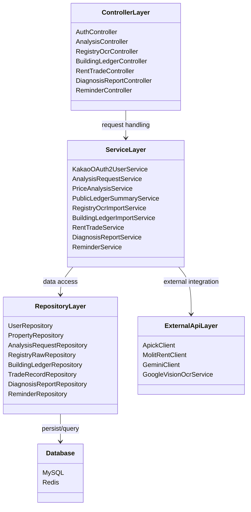

# 보고서용 서버 환경 정리

## 3-5 흐름도 및 UML 작성 방향

서버 보고서에는 Mermaid로 작성해도 충분합니다. 아래 항목을 넣으면 백엔드 구조와 동작 흐름을 설명하기 좋습니다.

- 시스템 아키텍처: [system-architecture.md](./system-architecture.md)의 `Backend System Architecture`
- 주요 분석 흐름도: [system-architecture.md](./system-architecture.md)의 `Main Analysis Flow`
- ERD: [erd.md](./erd.md)
- UML: Controller -> Service -> Repository 계층 구조 또는 핵심 도메인 클래스 관계를 Mermaid `classDiagram`으로 작성

예시 UML은 아래처럼 단순 계층 중심으로 넣는 것을 권장합니다.

## 3.1-6 시스템 환경

### 개발환경

#### 서버 개발환경

| 구분 | 내용 |
| --- | --- |
| 개발 언어 | Kotlin 1.9.25 |
| Java 버전 | JDK 17 |
| 프레임워크 | Spring Boot 3.5.13 |
| 빌드 도구 | Gradle Wrapper 8.14.4 |
| 주요 라이브러리 | Spring Web, Spring Security, OAuth2 Client, Spring Data JPA, Spring Data Redis, OpenFeign, Spring Actuator, SpringDoc OpenAPI, JWT, PDFBox |
| IDE | IntelliJ IDEA 권장 |
| 개발 OS | macOS 또는 Windows 64-bit 등 JDK 17 실행 가능 환경 |
| DB | MySQL |
| Cache/인증 보조 저장소 | Redis |
| 테스트 DB | H2 |
| API 문서 | Swagger UI / SpringDoc OpenAPI |
| 외부 API 연동 | Kakao OAuth2, APICK API, Google Vision OCR API, Gemini API, MOLIT RTMS API |

#### 서버 개발 시 필요한 환경 변수

| 환경 변수 | 용도 |
| --- | --- |
| `MYSQL_URL` | MySQL JDBC URL |
| `MYSQL_USERNAME` | MySQL 계정 |
| `MYSQL_PASSWORD` | MySQL 비밀번호 |
| `REDIS_HOST` | Redis host, 기본값 `localhost` |
| `REDIS_PORT` | Redis port, 기본값 `6379` |
| `KAKAO_CLIENT` | Kakao OAuth2 Client ID |
| `KAKAO_SECRET` | Kakao OAuth2 Client Secret |
| `KAKAO_REDIRECT_URI` | Kakao OAuth2 Redirect URI |
| `JWT_SECRET` | JWT 서명 키 |
| `HEADER` | JWT 헤더명 |
| `PREFIX` | JWT Prefix, 예: `Bearer` |
| `ACCESS_EXP` | JWT Access Token 만료 시간 |
| `APICK_AUTH_KEY` | APICK API 인증 키 |
| `GEMINI_API_KEY` | Gemini API 키 |
| `MOLIT_RENT_SERVICE_KEY` | 국토교통부 실거래가 API 서비스 키 |
| `GOOGLE_VISION_API_KEY` | Google Vision OCR API 키 |
| `FRONTEND_REDIRECT_URL` | OAuth2 로그인 성공 후 프론트엔드 리다이렉트 URL |
| `CORS_ALLOWED_ORIGINS` | CORS 허용 프론트엔드 Origin 목록 |

### 구동환경

#### 서버 구동환경

| 구분 | 내용 |
| --- | --- |
| 실행 방식 | Spring Boot 실행 JAR |
| Java 구동환경 | Java 17 JRE |
| 서버 OS | Linux 서버 환경, EC2 배포 기준 |
| 프로세스 관리 | systemd 서비스 `zipza-be` |
| 배포 경로 | `/opt/zipza-be` |
| 실행 파일 | `/opt/zipza-be/app.jar` |
| 환경 변수 파일 | `/opt/zipza-be/zipza-be.env` |
| 기본 서버 포트 | `8080` |
| Health Check | `GET /actuator/health` |
| DB | MySQL, 버전은 설정 파일에 명시되지 않음. 운영 DB 버전 확인 필요 |
| Cache/인증 보조 저장소 | Redis |
| 인증 방식 | Kakao OAuth2 로그인 후 JWT 발급, 요청 시 Bearer Token 인증 |
| 로그 | systemd journal |
| CI/CD | GitHub Actions `ubuntu-22.04` runner에서 JDK 17로 빌드 후 EC2 서버에 JAR 업로드 및 systemd 재시작 |

#### 웹 접속/연동 환경

| 구분 | 내용 |
| --- | --- |
| 클라이언트 | 로컬 실행 프론트엔드 웹에서 서버 API 호출 가능 |
| 브라우저 | Chrome 등 최신 웹 브라우저 |
| 로컬 프론트엔드 Origin | 기본 허용값: `http://localhost:3000`, `http://localhost:5173` |
| API 통신 방식 | REST API, JSON, Jackson `SNAKE_CASE` 응답 |

### 보고서 기재용 문장

서버는 Kotlin 1.9.25와 Spring Boot 3.5.13 기반으로 개발되었으며, JDK 17 환경에서 Gradle Wrapper를 사용해 빌드한다. 데이터 저장은 MySQL을 사용하고, 로그아웃된 JWT 토큰의 블랙리스트 관리를 위해 Redis를 사용한다. 인증은 Kakao OAuth2 로그인 이후 JWT를 발급하는 방식이며, Spring Security의 JWT 인증 필터를 통해 API 요청을 검증한다.

운영 서버는 Linux 기반 EC2 환경을 기준으로 하며, 빌드된 Spring Boot 실행 JAR를 `/opt/zipza-be/app.jar` 경로에 배치하고 systemd 서비스로 실행한다. 서버는 기본적으로 8080 포트에서 동작하며, `/actuator/health` 엔드포인트를 통해 정상 구동 여부를 확인한다. CI/CD는 GitHub Actions의 Ubuntu 22.04 환경에서 JDK 17로 빌드 후, EC2 서버에 JAR 파일을 업로드하고 systemd 서비스를 재시작하는 방식으로 구성되어 있다.
