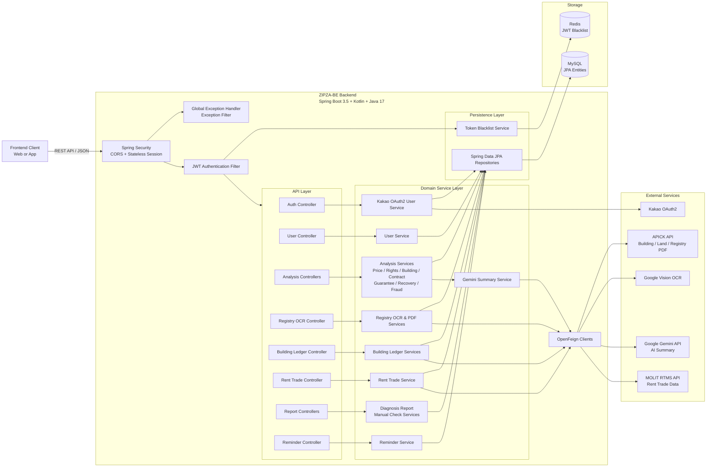
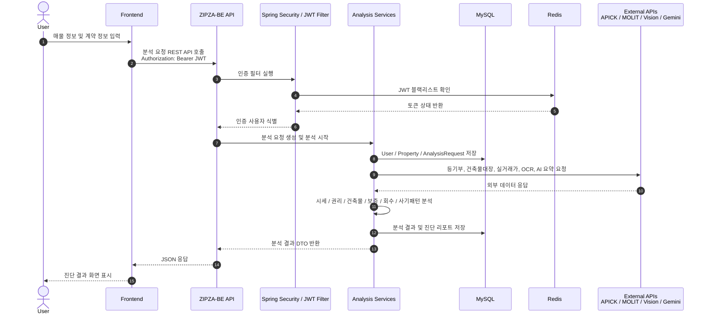

# ZIPZA-BE System Architecture

최종보고서에는 아래 두 가지를 넣는 것을 권장합니다.

- 전체 시스템 아키텍처: 프론트엔드, 백엔드, DB, Redis, 외부 API 의존성을 한눈에 보여줌
- 주요 처리 흐름: 사용자가 분석을 요청했을 때 인증, 저장, 외부 API 조회, 분석 결과 생성 과정을 보여줌

## Backend System Architecture

## Main Analysis Flow

## Report Description Example

ZIPZA-BE 백엔드는 Spring Boot 기반의 계층형 아키텍처로 구성된다. 클라이언트 요청은 Spring Security와 JWT 인증 필터를 거쳐 API Controller로 전달되며, 각 Controller는 도메인 Service에 처리를 위임한다. Service 계층은 JPA Repository를 통해 MySQL에 사용자, 매물, 분석 요청, 등기부, 건축물대장, 분석 결과, 진단 리포트 데이터를 저장한다.

외부 연동은 OpenFeign Client를 통해 분리되어 있으며, APICK API는 건축물대장/토지대장/등기부 PDF 발급에 사용되고, Google Vision OCR은 등기부 OCR 처리에 사용된다. MOLIT RTMS API는 전월세 실거래가 조회에 사용되며, Gemini API는 진단 리포트의 AI 요약 생성에 사용된다. Redis는 로그아웃된 JWT 토큰의 블랙리스트 저장소로 사용되어 stateless 인증 구조를 보완한다.
